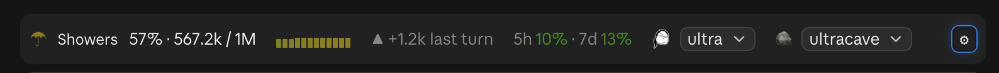
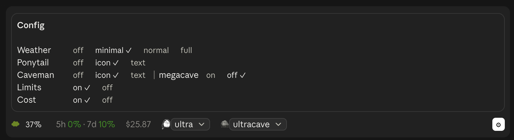

# overalls

A Claude Code mod that draws a status band above the prompt: a live "weather
forecast" of the context window, how much of your usage limits is spent, and the
level [Ponytail](https://github.com/DietrichGebert/ponytail) and
[Caveman](https://github.com/JuliusBrussee/caveman) are running at.



Once the context passes 75% (and Claude isn't mid-turn), a **Compact** button
appears in the band.

Where the widgets don't fit on one row, they wrap whole onto a second, while
Compact and **⚙** stay at the right of the first.

## Install

In the Claude Code terminal:

```
/plugin marketplace add Troepster/overalls
/plugin install overalls@overalls
/reload-plugins
```

Or from any shell, which also covers the desktop app (new sessions pick it up):

```bash
claude plugin marketplace add Troepster/overalls
claude plugin install overalls@overalls
```

If the band doesn't appear, start a new session or restart Claude Code.

To update: `/plugin marketplace update overalls` in Claude Code, or from a
shell:

```bash
claude plugin marketplace update overalls
claude plugin update overalls@overalls
```

Ponytail and Caveman are optional. Without Caveman its widget doesn't show;
without Ponytail its widget reads `not installed` until you set it to `off`.
Either way, the **⚙** Config box offers to install them.

A mod runs inside Claude Code with the same access Claude Code has, so read
`hooks/register.tsx` before installing.

## Settings

Each appears as a row in the Claude Code config menu under `overalls`; changing
one reloads the mod. The `/overalls` command sets them from the prompt, which
also works in the desktop app, where `/config` isn't available:

```
/overalls weather minimal
/overalls ponytail off
/overalls            (shows the current values)
```



The **⚙** at the right of the band opens a **Config** box above it with every
choice for every setting, the current one ticked; pressing one sets it, so you
see the change in the band as you make it. Press **⚙** again to close it. Hover
over a setting's name in the Config box for a line on what it is.

Pressing the forecast itself (`Showers`, or `67%` at `minimal`) steps
the weather detail through `minimal` → `normal` → `full` and round again; `off`
is set in the Config box.

Where the mod has a `/config` row (the terminal), `/overalls` sets that row.
Where it has none (the desktop app), it keeps the choice in the mod's own store
instead, and that choice wins over the `/config` value in every session until
you set the same setting with `/overalls` in a session that has the row.

| Setting | Values | Default | What it does |
|---|---|---|---|
| Weather detail | `off` · `minimal` · `normal` · `full` (typed; anything else counts as `full`) | `full` | How much of the forecast to show |
| Ponytail level | `off` · `icon` · `text` (typed; anything else counts as `icon`, and an old on/off value as `icon`/`off`) | `icon` | Show whether Ponytail is installed and its level, after its logo or the word `ponytail:` |
| Caveman mode | `off` · `icon` · `text` (typed; anything else counts as `icon`) | `icon` | Show Caveman's mode where it's installed, after 🪨 or the word `caveman:` |
| Offer megacave | `on` · `off` | `off` | List Caveman's Classical Chinese mode (`megacave`) in its dropdown; in the Config box it sits on Caveman's row |
| Usage limits | `on` · `off` | `on` | Show how much of your 5-hour and weekly limits is spent (subscriptions only) |
| Limit resets | `on` · `off` | `on` | Show how long until each limit resets (`5h 42% ↻1h20m`); in the Config box it sits on the Limits row |
| Limit run-out | `off` · `warn` · `always` (typed; anything else counts as `warn`) | `warn` | Warn when a limit will run out before it resets, at your pace over the last hour: `⚠1h40m` in amber, red under 30 minutes. `always` also shows `✓ lasts` for a limit that won't. Needs 10 minutes of samples and 2 points of movement first. Follows each limit, or stands alone (`5h ⚠1h40m`) with the limits off |
| Session cost | `on` · `off` | `off` | Show what this session has cost so far |
| MCP warnings | `on` · `off` | `on` | Warn when an MCP server or connector fails or needs signing in again |
| Running agents | `on` · `off` | `on` | Show `⧗ 2 agents` while subagents run; pressing it lists them (type and task) |
| Turns left | `on` · `off` | `on` | Show `⌛ ~6 turns`: about how many more turns fit, at the average growth of the last five that grew (red from 3) |
| Tool denials | `on` · `off` | `on` | Show `⛔ 2 denied` for tool calls refused by you, a hook, a permission rule or the auto-mode classifier; pressing it lists them, with Dismiss |

What each weather level shows:

| Level | Band |
|---|---|
| `minimal` | `☂ 67%` |
| `normal` | `☂ Showers 67% · 134.4k / 200k` |
| `full` | `normal` plus the last 12 turns as a sparkline and the change since last turn |
| `off` | nothing (the Ponytail segment still shows if enabled) |

## Ponytail detection

<picture>
  <source media="(prefers-color-scheme: dark)" srcset="assets/ponytail-logo-dark.png">
  
</picture>

- **Installed:** an enabled `ponytail@…` entry in `enabledPlugins`. Otherwise the
  band shows `not installed` beside the logo.
- **Level:** this session's own. Ponytail keeps a single level file for every
  session, so it can't say what *this* session runs at; Overalls tracks it per
  session instead, by Ponytail's rules:
  - a new session, and a compaction (Ponytail activates afresh), start at
    Ponytail's default: `$PONYTAIL_DEFAULT_MODE`, else `defaultMode` in its
    `config.json` (`$XDG_CONFIG_HOME/ponytail/`, or `~/.config/ponytail/`), else
    `full`
  - `/ponytail <level>` (or `/ponytail:ponytail <level>`), `/ponytail-review`,
    `stop ponytail` and `normal mode` change it as they go in.
  Another session's switch doesn't change this band.
- **Switched** by picking a level from the dropdown the level is drawn as (on
  mobile, which has no dropdown, a press steps ultra → full → lite → off), through
  Ponytail's own `/ponytail <level>` command.

## Installing Ponytail or Caveman

Where either isn't installed, its row in the **⚙** Config box has an **Install**
button. A mod can't install plugins, so it types a request into the prompt box,
for example:

```
Install the caveman Claude Code plugin: run `claude plugin marketplace add JuliusBrussee/caveman` then `claude plugin install caveman@caveman`.
```

Send it and Claude runs the two commands, each behind the usual permission
prompt. A plugin's hooks start with the next session.

## Caveman

- **Installed:** an enabled `caveman@…` entry in `enabledPlugins`; otherwise
  nothing shows.
- **Mode:** this session's own. Caveman keeps each session's mode in
  `.caveman-sessions/<session id>.mode` in your Claude config directory, so the
  band reads that. A session with no file of its own (one started
  before Caveman was installed) shows `off`; the shared `.caveman-active`, which
  holds the last mode set in any window, is read only when there's no session id.
- **Switched** by picking a mode from its dropdown (ultracave, caveman, off, and
  megacave when **Offer megacave** is on, since it answers in Classical Chinese; on mobile a press steps through them), through Caveman's own
  `/megacave`, `/ultracave`, `/caveman` and `/caveman off` commands.

## MCP warnings

Claude Code gives a mod no list of MCP servers or their state, so the band learns
of trouble from Claude's own tool calls:

- an `mcp__<server>__…` call that fails to sign in or connect (a bad-arguments
  error doesn't count), and
- the servers a ToolSearch reports as failed.

The band then shows `⚠ 2 MCP errors`. Pressing it opens an **MCP errors** box
above the band (like the Config box; one is open at a time) with a row per
server: its name, `sign in` or `failed`, the error as Claude saw it, and:

- **Reconnect**: for a claude.ai connector, Customize → Connectors, opened in
  the desktop app itself there (`claude://claude.ai/customize/connectors`), and
  at `https://claude.ai/customize/connectors` from the CLI or the web. For any
  other server, `/mcp` in the terminal; the desktop app's `/mcp` only lists
  servers, so there it says to sign in from a terminal session.
- **Dismiss**, and **Dismiss all**

A server leaves the list on its next successful call, or when dismissed. It's
caught on its first failure, not before.

## Data and access

Overalls makes no network requests and sends nothing anywhere. Everything it
does stays inside your Claude Code session:

- reads the session's context-window usage (`$.session.usage()`) after each turn
- reads your Claude Code settings to see whether Ponytail is enabled
- reads the session's usage-limit percentages, reset times and cost
  (`$.session.usage()`) when those widgets are on, and the clock to count down
  to each reset
- reads the session's list of subagents (`$.agent.list()`: type, task, status)
  when the agents widget is on
- redraws the band every 30 seconds, so countdowns and the agent count stay
  current, and at each redraw notes the usage-limit percentages
  (`$.session.usage()`), keeping the last hour of them in session memory to
  tell when a limit will run out
- reads your Claude Code settings to see whether Caveman is enabled and, if it
  is, this session's id and Caveman's mode file for it in your Claude config
  directory: `.caveman-sessions/<session id>.mode` (or `.caveman-active` when
  there's no session id)
- reads Ponytail's `config.json`, for its default level, and the
  `PONYTAIL_DEFAULT_MODE`, `XDG_CONFIG_HOME`, `CLAUDE_CONFIG_DIR` and `HOME`
  environment variables
- reads each prompt you submit only to spot a Ponytail command (`/ponytail …`,
  `stop ponytail`, `normal mode`), keeping nothing of it but the level
- keeps the last 12 readings and the Ponytail level in session state, which is
  gone when the session ends
- switches Ponytail's level or Caveman's mode only when you pick one from the
  band: it runs `/ponytail <level>`, or Caveman's command for the mode, as if you
  had typed it (which Claude reads, as it
  would your typing), or types it into the prompt box if it can't run it
- types an install request into the prompt box only when you press **Install**
  in the Config box; nothing is installed unless you send it and approve
  Claude's commands
- reads the name of each tool Claude calls and, when one is refused (by you, a
  hook, a permission rule or the auto-mode classifier), keeps the tool's name and
  the first 100 characters of the reason in session state until you dismiss it
- reads the name of each MCP tool Claude calls, the error text when one fails,
  and the failed-server list a ToolSearch returns, keeping only each failing
  server's name, whether it needs signing in or failed, and the first 100
  characters of its error; it runs `/mcp` only when you press **Reconnect** in the terminal
- reads `CLAUDE_CODE_ENTRYPOINT` while the MCP errors box is open, to tell the
  desktop app from the CLI and the web; in the desktop app, pressing
  **Reconnect** on a connector hands `claude://claude.ai/customize/connectors` to
  the system's opener (`open` on macOS, `xdg-open` on Linux, `cmd /c start` on
  Windows), which opens that page in the app
- compacts the conversation only when you press its **Compact** button; where
  Claude Code doesn't let a plugin compact (the desktop app), that press runs
  `/compact` for you, or types it into the prompt box if it can't run it
- changes its own settings only when you run `/overalls weather …` or
  `/overalls ponytail …` (and the rest), pick one in the **⚙** Config box, or press the
  forecast to step the weather detail: through the `/config` row where there is one (saved in
  your Claude Code settings, as `/config` saves them), otherwise in the mod's own
  store, a small JSON file Claude Code keeps for the plugin in your Claude config
  directory.

Apart from that store, it writes no files, and the only program it starts is that
system opener, with that one fixed address, when you press **Reconnect**.

It hooks four events only to observe them, never changing what they carry:
`tool.call` (note an MCP server failing or answering again, and a refused call), `turn.complete`
(take a reading), `session.compact` (record the drop after a
compaction, and reset the Ponytail level to its default) and `prompt.submit`
(note a Ponytail switch once your prompt has gone in, so `/ponytail lite` shows
straight away). It also draws the band above
the prompt.

## Development

Load your clone directly instead of the installed copy, so saves hot-reload:

```bash
claude --plugin-dir ~/Projects/overalls
```

or for every session (including the desktop app), in `~/.claude/settings.json`:

```json
{ "env": { "CLAUDE_CODE_PLUGIN_DIRS": "~/Projects/overalls" } }
```

Don't also have the marketplace copy installed, or you'll get two bands.

```bash
claude plugin validate .
claude plugin test .
```

`hooks/register.tsx` is the module; `types/index.d.ts` declares the state it
keeps. To add a setting, declare a field under `userConfig` in
`.claude-plugin/plugin.json` and read it from `options` in `register`.

## Licence

[MIT](LICENSE)

## Credits

[Ponytail](https://github.com/DietrichGebert/ponytail) and its logo are by
[Dietrich Gebert](https://github.com/DietrichGebert), used under the MIT licence
([`assets/PONYTAIL-LICENSE`](assets/PONYTAIL-LICENSE)). Overalls only reads the
level Ponytail writes; it isn't affiliated with or endorsed by the Ponytail project.

Caveman is by [Julius Brussee](https://github.com/JuliusBrussee); "Caveman" is
his trademark. Overalls only reads the mode Caveman writes and runs its
commands, uses none of its logos (🪨 is a stock emoji), and isn't affiliated
with or endorsed by the Caveman project.
